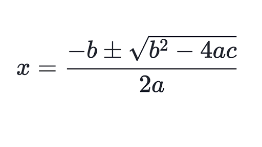

Question Specification:  
  
Write a program that finds the roots of the equation a*x*2 + b*x* + c = 0 using the formula  
  
    
  
Have the program prompt for the values of a, b, and c, then print both values of x. (If b2 - 4ac  
is negative, the program should instead print a message to the effect that the roots are complex.)
  
